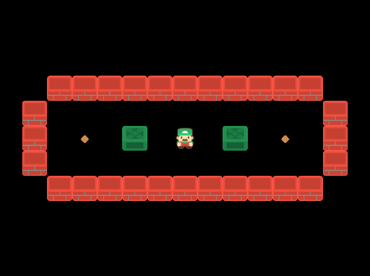
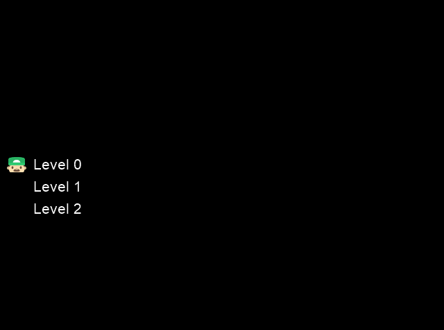

# Sokoban

Sokoban je logická hra, v níž hráč posouvá bedny v bludišti a snaží se je umístit na vyznačené pozice (malé kosočtverce).
K naprogramování této hry bude potřeba knihovna `pyglet`, `math` a `sys`.
Veškeré obrázky, které budou použity, jsou volně dostupné na internetové adrese https://kenney.nl/assets/sokoban.



Abychom nemuseli zvlášť každému obrázku přidávat sprite, tak si vytvoříme funkci, která to udělá za nás.
Jako atribut funkce bude proměnná image, která bude reprezentovat obrázek.
Kromě přidělování spritů zde i určíme měřítko spritu, aby vše mělo správnou velikost:

```python
def make_sprite(image):
    sprite = pyglet.sprite.Sprite(image)
    sprite.scale = TILE_SIZE / image.width
    return sprite
```

Vyzkoušíme si naprogramovat hru se třemi levely. Proto budeme potřebovat třídu Level, která bude mít v konstruktoru kromě atributu `self` i `name` (0, 1, 2) a `char` (charakter).
Uvnitř konstruktoru si nastavíme výšku a šířku dané úrovně.

Další třídou bude Game, v níž pracujeme s uživatelem vybraným levelem. Proto bychom měli nastavit počáteční souřadnice hráče na obou osách a přiřadit mu `sprite`.
Vytvoříme si i slovník `objects`, ten bude zatím prázdný, ale vrátíme se k němu při zjišťování, zda hráč vyhrál.
Rovněž zkontrolujeme i ostatní charaktery a vytvoříme jejich sprity, pro všechny cílové pozice pokladů nastavíme jejich vykreslování na `goal_batch` a pro ostatní charaktery
bude vykreslování `main_batch`.

Uvnitř třídy Game si vytvoříme funkci `is_won`. V ní budeme kontrolovat, zda poklad je na cílové pozici. Podle toho zjistíme jestli hráč vyhrál.
Třída `Game` bude mít také vlastní funkci `draw`, v níž si nejprve určíme měřítko `scale` hry v závislosti na výšce a šířce okna. Na začátku funkce posuneme počátek na střed okna. V další části
budeme pomocí posouvání souřadnic počátku vykreslovat různé druhy charakterů (např. stěny, cílové pozice a hráče). Budeme tu i kontrolovat funkci `is_won`, pakliže hráč vyhraje, tak to oslavíme
radostnými výskoky hráče.

```python
if self.is_won():
    jump = abs(math.sin(time.time() * 10))
    self.player_sprite.y += jump * TILE_SIZE / 4
```

Další důležitou funkcí uvnitř třídy Game je `move`. Tato funkce bude zajišťovat pohyb objektů. Nejprve zkontrolujeme, zda hráč už nevyhrál, protože
v tom případě by se nepotřeboval pohybovat. Pomocí proměnných `new_x` a `new_y` budeme vytvářet nové souřadnice na obou osách. Dále musíme zajistit to, aby se hráč nemohl dostat
za zdi, které ohraničují hráčské pole. Do n-tice `bloking_objects` si nejprve vložíme všechny objekty. Když bude za hráčem poklad, který potřebuje posunout, tak mu to umožní
proměnné `behind_x` a `behind_y`. Pomocí n-tice `behind_objects` budeme kontrolovat, jestli je za tlačeným pokladem místo. Pakliže tam místo nebude hráči nepůjde poklad posunout.

Abychom si na začátku mohli vybrat level, který si chceme zahrát, tak se musíme dostat do souboru "levels.txt". K tomu slouží níže vložený kód.

```python
try:
    levels_filename = sys.argv[1]
except IndexError:
    levels_filename = 'levels.txt'
```

Nyní by bylo vhodné vytvořit třídu, díky které si budeme vybírat level, který si chceme zahrát. Tuto třídu pojmenujeme `LevelSelector`, v jeho konstruktoru si vytvoříme prázdný seznam `levels`,
proměnnou `current_y`, pro níž nastavíme počáteční hodnotu na nulu, dále proměnnou `current_name`, která bude sice nastavena na prázdný řetězec, ovšem díky funkci `sys.argv` se později změní.
Neměli bychom zapomenout na proměnnou `current_level`, díky níž budeme přidávat námi zvolený level do seznamu `levels` a bude zatím vypadat takto (`current_level = {}`).
Poté co se otevře soubor `levels.txt` použijeme funkci `rstrip()`, která vrací kopii řetězce, v němž byly všechny znaky odstraněny z konce řetězce. Následně budeme kontrolovat všechny charaktery
v `tile_chars`. Pokud se nebudou rovnat prázdnému prostoru, tak do proměnné `current_level` vložíme seznam, který bude obsahovat informace o aktuální pozici. Jestliže se charakter rovná prázdému
prostoru, tak zvýšíme proměnnou `current_y` o jednu jednotku. Když už bude v proměnné `current_level` informace o tom jaký level bude chtít hráč hrát, tak tento level přídáme do seznamu `levels`.
Poté co si hráč vybere level a začne jej hrát, tak bychom měli vrátit jméno a pozici při vybírání levelu na počáteční hodnoty. Rovněž vrátíme `current_level` do počátečního stavu.
Vytvoříme si zde proměnnou `index`, kterou použijeme u vykreslování výběru levelů.

I třída `LevelSelector` bude mít svou funkci `draw`. V této funkci bude probíhat vykreslování toho co vydíme jako první při spuštění hry.



Všechny nápisy levelů budou v podobě labelů. Pomocí proměnné `index` se při vybírání levelů  budou posouvat labely nahoru a dolů. Obličej bude mít vzhledem k oknu stále stejnou pozici.

Pro pohyb hráče v okně musíme vytvořit funkce `move`, která bude mít kromě parametru `self` i parametry `dx` a `dy` pro pohyb na obou osách. Aby se hráč dostal do levelu, který chce hrát,
tak potřebujeme funkci `enter`, ta obstará načtení levelu. Podobné to bude u funkce `exit`, když bude chtít hráč ukončit hru, tak zavoláme tuto funkci. V neposlední řadě potřebujeme metodu
`tick`, ta bude ovšem obsahovat jen příkaz `pass` (nic se nestane). K této metodě budeme potřebovat ještě časovač, díky němuž se bude okno vykreslovat tak rychle jak budeme chtít.

```python
def move(self, dx, dy):
    if self.game:
        self.game.move(dx, dy)
    else:
        self.index = (self.index - dy) % len(self.levels)
        if dx > 0:
            self.enter()

def enter(self):
    if not self.game:
        self.game = Game(self.levels[self.index])
    elif self.game.is_won():
        self.game = None

def exit(self):
    if self.game:
        self.game = None
        return True

def tick(self, dt):
    pass
```

Na konci nesmí chybět funkce `on_draw`, která zajišťuje vykreslování celého okna a `on_key_press`, jenž nám umožňuje ovládat hráče pomocí šipek nebo vybírat levely.